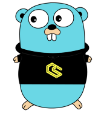

<div align="center">
  
</div>
<div align="center">
  <a href="https://www.gnu.org/licenses/gpl-3.0">
    
  </a>
  <a href="https://godoc.org/github.com/ChainSafe/gossamer">
    
  </a>
  <a href="https://goreportcard.com/report/github.com/ChainSafe/gossamer">
    
  </a>
  <a href="https://travis-ci.org/ChainSafe/gossamer/">
    
  </a>
</div>
<div align="center">
  <a href="https://codeclimate.com/github/ChainSafe/gossamer/badges">
    
  </a>
  <a href="https://codeclimate.com/github/ChainSafe/gossamer/test_coverage">
    
  </a>
</div>
<br />

## A Blockchain Framework

Gossamer is a blockchain framework based on the specification for the [Polkadot Host](https://github.com/w3f/polkadot-spec) (formerly known as the "Polkadot Runtime Environment"). Gossamer can be used to build and run node implementations for different blockchain protocols within the Polkadot ecosystem and expanded upon to support blockchain protocols outside the Polkadot ecosystem.

<!-- The Polkadot Host is a modular, customizable framework for building blockchains. It has a swappable WASM runtime (ie. state transition function) that can be replaced even after the blockchain has launched without hard forks. It also has a generic extrinsic and block format which are specified in the runtime. The runtime can be written in any language that compiles to WASM. -->

<!-- For more information, check out the [Gossamer Wiki](https://github.com/ChainSafe/gossamer/wiki). -->

## Gossamer Architecture

Gossamer includes official [node implementations](#node-implementations) used to support the Polkadot ecosystem, sets of shared [node services](#node-services) used to build node implementations, and a collection of [modular packages](#modular-packages) that make up the parts and pieces used to build node implementations, node services, and other supporting tools and services.

### Node Implementations

Gossamer includes a node implementation for the Gossamer Testnet and node implementations _in development_ for the Kusama Network and the Polkadot Network.

| package           | description |
|-                  |-            |
| `node/gssmr`      | a full node implementation and rpc server for Gossamer Testnet |
| `node/ksmcc`      | a full node implementation and rpc server _in development_ for Kusama Network |
| `node/plkdt`      | a full node implementation and rpc server _in development_ for Polakdot Network |

### Node Services

Gossamer includes shared node services used to build and run node implementations (currently each node implementation is using a set of shared node services that make up the base implementation for the Polkadot Host).

| package           | description |
|-                  |-            |
| `dot/core`        | orchestrates system interactions |
| `dot/network`     | peer-to-peer service using libp2p |
| `dot/rpc`         | ... |
| `dot/state`       | ... |

### Modular Packages

Gossamer includes a collection of modular packages that make up the parts and pieces used to build node implementations, node services, and other supporting tools and services.

| package           | description |
|-                  |-            |
| `lib/babe`        | BABE implementation |
| `lib/blocktree`   | ... |
| `lib/common`      | common types and functions |
| `lib/crypto`      | ... |
| `lib/database`    | generic database using badgerDB |
| `lib/genesis`     | ... |
| `lib/grandpa`     | GRANDPA implementation |
| `lib/hexcodec`    | ... |
| `lib/keystore`    | ... |
| `lib/runtime`     | WASM runtime integration using Wasmer |
| `lib/scale`       | SCALE encoding and decoding |
| `lib/services`    | ... |
| `lib/transaction` | ... |
| `lib/trie`        | modified merkle-patricia trie implementation |

## Running Gossamer

The `gossamer` command can be used to run node implementations that are within this repository.

### Prerequisites

go 1.13.7

### Installation

```
go get -u github.com/ChainSafe/gossamer
```

### Build Gossamer

```
make gossamer
```

### Run Gossamer Node

```
./build/bin/gossamer init
```

```
./build/bin/gossamer
```

## Contribute

- Check out [Contributing Guidelines](.github/CONTRIBUTING.md)  
- Have questions? Say hi on [Discord](https://discord.gg/Xdc5xjE)!

## Donate

Our work on gossamer is funded by grants. If you'd like to donate, you can send us ETH or DAI at the following address:
`0x764001D60E69f0C3D0b41B0588866cFaE796972c`

## License

_GNU Lesser General Public License v3.0_

<br />
<p align="center">
	
</p>
