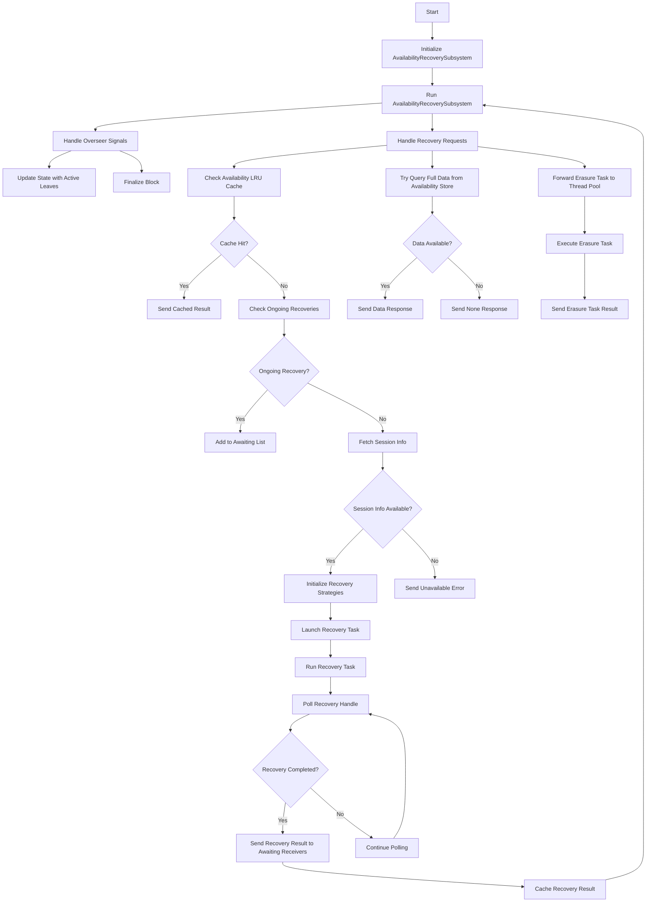

## Availability Recovery Subsystem Design

### Intro
The design for the Availability Recovery Subsystem is based on the Polkadot Host specification as detailed in the
[Polkadot Parachain Host Implementers' Guide](https://paritytech.github.io/polkadot-sdk/book/node/availability/availability-recovery.html).
This subsystem is responsible for recovering the data made available via the Availability Distribution subsystem,
neccessary for candidate validation during the approval/disputes processes. Additionally, it is also being used by
collators to recover PoVs in adversarial scenarios where the other collators of the para are censoring blocks.
In practice, there are various optimisations implemented in this subsystem which avoid querying all chunks from different validators and/or avoid doing the chunk reconstruction altogether.


### Flow
General flow is pretty straight forward. Subsystem awaits requests from Overseer to recover particular candidate for particular `CandidateReceiptV2`.
The data is fist checked to exist in LRU cache or in Availability store if not recovery process starts.
There are several possible strategies to recover availability data and they will be described below.
When data is recovered is being sent back to `ongoing_recoveris` pull where it is processed by being written to LRU cache and returned to requestors via `response_sender` channel.
Hence the flow is pretty straight forward and most details related to optimisations and possible strategies.




### State
Subsystem has a state that holds:
- map of ongoing recoveries
- live_block: (BlockNumber, Hash), /// A recent block hash for which state should be available. **(NOT SURE WHAT IS THAT)**
- availability_lru -  /// An LRU cache of recently recovered data. So we can avoid expensive data recoveries
- runtime_info: RuntimeInfo, /// Also do not know why

### Ongoing recoveries

handle_recover function: Reads state.ongoing_recoveries to check for ongoing recoveries and update the awaiting vector.
run function: Reads state.ongoing_recoveries to select the next completed recovery and process the result.

### availability LRU
Implement availability_lru cache that is storing recently recovered availabilities.
Add calls to LRU cache within handle recovery so in case if availability is already in cache return from it avoiding full recovery process.
Put successfully recovered availability to LRU as soon as they correctly recovered


### main loop
1. The `futures::select!` macro in the run method is used to concurrently poll multiple futures and handle whichever one completes first
   In this code, the futures::select! macro is used to handle the following events:

erasure_task = erasure_task_rx.next(): Handles the next erasure task from the erasure_task_rx receiver.
signal = ctx.recv().fuse(): Handles the next signal from the overseer.
in_req = recv_req: Handles the next incoming request.
output = state.ongoing_recoveries.select_next_some(): Handles the next completed recovery task.  
The select_next_some method polls the next completed future from this collection and returns it. The result is then 
processed to handle the completed recovery task, update the cache, and handle any errors that may have occurred.


**FLOW**
Runs loop and waits for next concurrent processes:
- erasure_task_rx. Creates erasure_task channel.
- signal = ctx.recv().fuse() Awaits signals from Overseer `AvailabilityRecoveryMessage::RecoverAvailableData`
    - handle_recover()
- in_req = recv_req => Awaits signals from `req_receiver` that is the network interface.
- output = state.ongoing_recoveries.select_next_some()


/// Queries the full `AvailableData` from av-store.
`query_full_data`. Sends message to availability store to fetch fulldata. (Probably in case we keep full or achive node?)


### handle_recover
The handle_recover method handles an availability recovery request. It is responsible for initiating the recovery process for a given candidate receipt and session index.
The method checks if the requested data is already cached or being recovered, and if not, it launches a new recovery task.

check ongoing recovery task if one is present. Push response_sender to the list of awaiting for result. (So we need ot create this dependencie as well)

Fetching the runtime session params if error, return error.

Then match the recovery strategy kind. Either (BackersFirstIfSizeLower | BackersFirstIfSizeLowerThenSystematicChunks) or else

query the chunk_size. Estimate if chunk_size is small_pov_size. If unestimatable then small_pov_size = false;

What is chunk_size and small_pov_size ?
We need to implement query_chunk_size function. This is a function that sends AvailabilityStoreMessage::QueryChunkSize message via overseer to availability_store to estimate size of candidate with specified candidate_hash.


THen we define recovery_strategies list.
This is where it gets little bit tricky to understand what is going on


Based on the recovery strategy kind and the PoV size, it may add a FetchFull strategy to fetch from the backing group.
- If the PoV size is smaller than the specified threshold (fetch_chunks_threshold), it prefers fetching from the backing group.

It always adds a `FetchChunks` strategy as a fallback to recover using regular chunks. We can use this as a MVP method and implement first. (IMPLEMENT FULLFETCH)
`RecoveryStrategyKind` - run only within `handle_recover` function and much used to distinguish test runs from real runs. If StrategyKind is any of `BackersFirstIfSizeLower` or `BackersFirstIfSizeLowerThenSystematicChunks`
then recovery based on PoV size.

###  awaiting receivers
The RecoveryHandle struct is used to manage ongoing recovery tasks and their associated awaiting receivers. It is primarily used in the handle_recover and launch_recovery_task functions.

`ongoing_recoveries: FuturesUnordered<RecoveryHandle>,` is a part of AR State and holds array of `RecoveryHandle`

`RecoveryHandle` consist of candidate_hash (candidate we need to recover) and `awaiting: Vec<oneshot::Sender<RecoveryResult>>,` Vector of oneshot channels that awaits result of the recovery.

###  launch_recovery_task
`launch_recovery_task(state, ctx, response_sender, recovery_strategies, params) -> Result<()>`
Create the RecoveryTask and launch it as a background task running recovery_task.run().

recovery_task.run(mut self) -> Result<AvailableData, RecoveryError>
Loop:
Pop a strategy from the queue. If none are left, return RecoveryError::Unavailable.
Run the strategy.
If the strategy returned successfully or returned RecoveryError::Invalid, break the loop.

When the recovery is done, the result is sent to all awaiting receivers with ongoing_recoveries
and cached in the availability_lru cache. Here's a detailed explanation of the flow.


## Availability recovery State


### Recovery task
A RecoveryTask is a structure encapsulating all network tasks needed in order to recover the available data in respect to a candidate.


### run
Recovery task is run by `launch_recovery_task` function and is run based on strategy that was defined.
First it again check availability store in case data is available there.
And then strategy is run

### Recovery strategies
Each recovery task uses list of different recovery strategies
There are 3 recovery strategies FetchFull, FetchSystematicChunks, and FetchChunks (more [details](https://paritytech.github.io/polkadot-sdk/book/node/availability/availability-recovery.html#recovery-strategies))
But within the code we define only two flows BackersFirstIfSizeLower and BackersFirstIfSizeLowerThenSystematicChunks those are basically list strategies with different order of apply.

### Inter strategies task::strategy::State
Hold the Task state, basically stores received chunks or errors.


### Recovery
How work is dispatched to the pool from the recovery tasks:
Once a recovery task finishes retrieving the availability data, it needs to reconstruct on chunks and/or  encode the data which are heavy CPU computations.
These depends on the strategy we choose.
FetchChunks need reconstruction, FullFetch reencode and FetchSystematicChunks does not need reedsalomon calculations

- do so it sends an `ErasureTask` to the main loop via the `erasure_task` channel, and  ts for the results over a `oneshot` channel.

Assuming we have erasure coding:


## Strategies
###  FetchChunks
_The least performant strategy but also the most comprehensive one. It's the only one that cannot fail under the byzantine threshold assumption,
so it's always added as the last one in the recovery_strategies queue. Performs parallel chunk requests to validators. When enough chunks were received, do the reconstruction.
In the worst case, all validators will be tried._
Implementation of this strategy requires implementation (or at least use binding for reed-solomon reconstruction)

Reconstruct method is available to call from the `lib/erasure` module.

In Parity implementation they assume that FetchChunks is always run as a last resort strategy, hence they do initially do some checks and remove all requested validators from list.

**Main loop**
- check amount of chunks recovered if >= threshold recover them.
- Some unavailability check pretty simple in logic though no info why they run it.
- get_desired_request_count
- launch_parallel_chunk_requests
- wait_for_chunks

###  FullFetch
_This strategy tries requesting the full available data from the validators in the backing group to which the node is already connected.
They are tried one by one in a random order. It is very performant if there's enough network bandwidth and the backing group is not overloaded. The costly reed-solomon reconstruction is not needed._
**NOTE: there are some part os the code that are only necessary for collators so we can skip them for now.**

This strategy requires `Reencode` the data into erasure chunks in order to verify  the root hash of the provided Merkle tree, 
which is built on-top of the encoded chunks.
This (expensive) check is necessary, as otherwise we can't be sure that some chunks won't have been tampered with by the backers, 
which would result in some validators considering the data valid and some.
That depends on `erasure_coding.obtain_chunks_v1` method and is available to call from the `lib/erasure` module


**Main loop**
- take naext validatorfrom array
- create data request
- send message NetworkBridgeTxMessage::SendRequests with data request
- awaits for full data to be returned if so data to be Reencoded and validated
- repeat until data is available or all validators requested.

### FetchSystematicChunks
_Very similar to FetchChunks below but requests from the validators that hold the systematic chunks, so that we avoid reed-solomon reconstruction.
Only possible if node_features::FeatureIndex::AvailabilityChunkMapping is enabled and the core_index is supplied (currently only for recoveries triggered by approval voting).
More info in RFC-47._
We can only attempt systematic recovery if we received the core index of the candidate and chunk mapping is enabled.
`availability_chunk_mapping_is_enabled` Tells if the chunk mapping feature is enabled. Enables the implementation of
[RFC-47](https://github.com/polkadot-fellows/RFCs/blob/main/text/0047-assignment-of-availability-chunks.md).
Must not be enabled unless all validators and collators have stopped using `req_chunk`
protocol version 1. If it is enabled, validators can start systematic chunk recovery.

### General algorithm to choose a strategy
If the estimated available data size is smaller than a configured constant (currently 1Mib for Polkadot or 4Mib for other networks), try doing FetchFull first.
Next, if the preconditions described in FetchSystematicChunks above are met, try systematic recovery. As a last resort, do FetchChunks.

### Requesting chunks
`launch_parallel_chunk_requests` function is responsible for launching parallel requests to fetch chunks from validators. 
It ensures that the desired number of chunk requests are in progress by sending requests to available validators.
The logic is common for both FetchChunks and FetchSystematicChunks. The type of strategy only used in metrics.

Using network request/response module to create with_fallback type of request and using v2 ChunkFetchingRequest as a 
main request and v1 ChunkFetchingRequest as a fallback in case validator does not supports it.

When validator receives a chunk it is stored in a map with chunk_id as a key this way we eliminate chunk duplicates 
and calculate only distinct ones.

There is only one chunk per validator, hence we ask validator only for 1 chunk. 

## Implementation design
### Subsystem Structure
The implementation must conform to the `Subsystem` interface defined in the `parachaintypes` package. It should live in
a package named `availabilityrecovery` under `dot/parachain/availability-distribution`.

### Incoming messages
Subsystem should handle 3 outside messages: 
- OverseerSignal::ActiveLeaves - update live block to the recent
- OverseerSignal::BlockFinalized - do nothing (?)
- OverseerSignal::Conclude - graceful shutdown
- AvailabilityRecoveryMessage::RecoverAvailableData - request to recover candidates availability data
### Outgoing messages
- AvailabilityStoreMessage::QueryAvailableData - try to query availability data from availability store using overseer.
- AvailabilityStoreMessage::QueryChunkSize - query chunk size. Used to select strategy. (eg FetchFull if PoV size constraints are met).
- NetworkBridgeTxMessage::SendRequests - message to network bridge to use request/response module for requesting chunks from other validators.
- ErasureTask::Reconstruct, Reencode - messages we sent within a subsystem to ErasureCoding thread that is responsible for doing Reconstruct and Reencode. 

### Types:
- State 
    - Holds array of tasks to recover. Subsystem should asynchronously process all incoming request and create a goroutine for each of it. 
    - Live block
      Last block for runtime params updgrade
    - LRU cache for recent availability data to improve performance for recently requested availabilities. 
- RecoveryParams
```go
type RecoveryParams struct {
    CandidateHash       string
    ValidatorAuthorityKeys []string
    NValidators         int
    ErasureRoot         string
    PovHash             string
    PostRecoveryCheck   PostRecoveryCheck
}
```

### Interfaces
We need to define interfaces for all 3 strategies (FetchFull, FetchSystematicChunks, FetchChunks)
```go
type RecoveryStrategie interface {
    DisplayName() string
    StrategyType() string
    Run(params RecoveryParams) (AvailableData, error)
}
```

### Recovery pipeline
Every incoming request should be written to ongoing recoveries map.
We might also want to add RWMutex for state to be sure that while we adding RecoveryResult channel to awaiting it 
is not getting read from, hence leading that newly added awaiter never get resolved.

```go
type RecoverySubsystemState struct {
    OngoingRecoveries map[string]*RecoveryHandle // key is the CandidateHash allows for O(1) lookups
	mutex mutex.RWMutex
}

type RecoveryHandle struct {
CandidateHash string
Remote        chan RecoveryResult
Awaiting      []chan RecoveryResult
}
```
For each recovery request we theoretically need to to try all three strategies one by one. _FullFetch_ first, then
_FetchSystematicChunks_, and then _FullFetch_. FullFetch is a fallback strategy that always we try in the end and the
first two have their constraints that are described above. 
Constraints are defined based on subsystem params, `chunk_size`, PoV size limit or as it called `CONSERVATIVE_FETCH_CHUNKS_THRESHOLD` 
and `FETCH_CHUNKS_THRESHOLD`.


