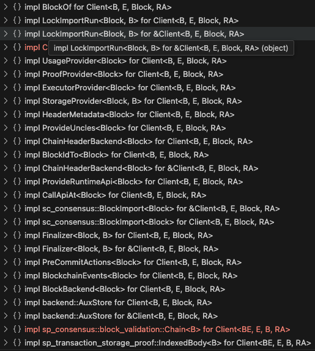

# `db.Backend` Integration into Gossamer

The introduction of `api.Backend` interface and the implementation of the interface `db.Backend` has been completed in [PR #4405](https://github.com/ChainSafe/gossamer/pull/4405). The `api.Backend` interface and it's associated implementation closely resembles the [`sc_api::backend::Backend`](https://github.com/paritytech/polkadot-sdk/blob/030cb4a71b0b390626a586bfe7117b7c66b4700c/substrate/client/api/src/backend.rs#L517) trait.  It introduces a client backend that handles historical block storage, as well fork aware state trie storage.  It incorporates previous work regarding `TrieBackend` ([PR #4318](https://github.com/ChainSafe/gossamer/pull/4318)) which incorporates `TrieDB` work we have worked on previously ([PR #4315](https://github.com/ChainSafe/gossamer/pull/4315)).  This client backend supports multiple pruning modes to allow persistence of a constrained window of finalized blocks, all finalized blocks, and no pruning at all.  Pruning applies both to the block history as well as the trie state associated to blocks.  

## Overview of current code

There need to be something that utilizes `db.Backend` to fulfill the current `state.BlockState` and `state.InmemoryStorageState` functionalities.

### `BlockState`

Currently the `state.BlockState` type is essentially used to store block history and to set finalization for stored blocks. The type `state.BlockState` does not have a corresponding interface that represents the entire public API of the type.  After looking through the code, I've compiled the entire public interface of `state.BlockState` that is called by other packages.  The interface is as follows:

```go
type BlockState interface {
	AddBlock(*types.Block) error
	AddBlockWithArrivalTime(block *types.Block, arrivalTime time.Time) error

	BestBlock() (*types.Block, error) 
	BestBlockHash() common.Hash
	BestBlockHeader() (*types.Header, error)
	BestBlockNumber() (number uint, err error)
	GenesisHash() common.Hash

	GetBlockBody(hash common.Hash) (*types.Body, error)
	GetBlockStateRoot(bhash common.Hash) (common.Hash, error)
	GetBlockByHash(common.Hash) (*types.Block, error)
	GetBlockByNumber(blockNumber uint) (*types.Block, error)
	GetFinalisedHeader(round, setID uint64) (*types.Header, error)
	GetFinalisedHash(round, setID uint64) (common.Hash, error)
	GetHashesByNumber(blockNumber uint) ([]common.Hash, error) // not sure why we need this, use `GetHashByNumber`?
	GetHashByNumber(blockNumber uint) (common.Hash, error)
	GetHeader(bhash common.Hash) (*types.Header, error)
	GetHeaderByNumber(num uint) (*types.Header, error)
	GetHighestFinalisedHeader() (*types.Header, error)
	GetHighestFinalisedHash() (common.Hash, error)
	GetHighestRoundAndSetID() (uint64, uint64, error)
	GetJustification(common.Hash) ([]byte, error)

	GetNonFinalisedBlocks() []common.Hash // can probably be achieved by getting last finalized, then traversing children
	GetSlotForBlock(common.Hash) (uint64, error)

	HasFinalisedBlock(round, setID uint64) (bool, error)
	HasHeader(hash common.Hash) (bool, error)
	HasJustification(hash common.Hash) (bool, error)
	HasHeaderInDatabase(hash common.Hash) (bool, error) // can probably just use `HasHeader`

	SetFinalisedHash(hash common.Hash, round uint64, setID uint64) error
	SetHeader(header *types.Header) error
	SetJustification(hash common.Hash, data []byte) error

	GetRuntime(blockHash common.Hash) (instance runtime.Instance, err error)                          // can be achieved by retrieving digest from block and decoding
	HandleRuntimeChanges(newState *rtstorage.TrieState, in runtime.Instance, bHash common.Hash) error // will have to be recreated

	CompareAndSetBlockData(bd *types.BlockData) error
	
	IsDescendantOf(parent, child common.Hash) (bool, error)
	LowestCommonAncestor(a, b common.Hash) (common.Hash, error)
	NumberIsFinalised(blockNumber uint) (bool, error)

	Range(startHash, endHash common.Hash) (hashes []common.Hash, err error)
	RangeInMemory(start, end common.Hash) ([]common.Hash, error)

	StoreRuntime(blockHash common.Hash, runtime runtime.Instance)

	FreeImportedBlockNotifierChannel(ch chan *types.Block)
	GetImportedBlockNotifierChannel() chan *types.Block
	FreeFinalisedNotifierChannel(ch chan *types.FinalisationInfo)
	GetFinalisedNotifierChannel() chan *types.FinalisationInfo

	RegisterRuntimeUpdatedChannel(ch chan<- runtime.Version) (uint32, error)

	IsPaused() bool
	Pause() error
}
```

### `StorageState`

`StorageState` is an interface that is locally defined in a number of packages.  It represents the functionality regarding accessing the current `TrieState` which gives access to the underlying in memory state trie (canonically known as "storage") for a given hash.  Generation of storage trie proofs is part of this interface as well.  The interface with largest amount of methods is defined in [`dot/core`](https://github.com/ChainSafe/gossamer/blob/398dd6d951f63e83a4e7e5bf4e4bf8c7e9065c5d/dot/core/interfaces.go#L43).  The implementation of these `StorageState` interfaces is implemented by the type [`state.InmemoryStorageState`](https://github.com/ChainSafe/gossamer/blob/2eff00475ac1234ac1701f596808f93b3bf0bd46/dot/state/inmemory_storage.go#L33). I've compiled the entire public interface of `state.InmemoryStorageState` that is called by other packages.  The interface is as follows:

```go
type StorageState interface {
	TrieState(root *common.Hash) (*rtstorage.TrieState, error)
	StoreTrie(*rtstorage.TrieState, *types.Header) error
    
	GetStateRootFromBlock(bhash *common.Hash) (*common.Hash, error)
	GenerateTrieProof(stateRoot common.Hash, keys [][]byte) ([][]byte, error)
	GetStorage(root *common.Hash, key []byte) ([]byte, error)
	GetStorageByBlockHash(bhash *common.Hash, key []byte) ([]byte, error)
	StorageRoot() (common.Hash, error) // best block state root, use HeaderBackend
	Entries(root *common.Hash) (map[string][]byte, error)  // should be overhauled to iterate 
	GetKeysWithPrefix(root *common.Hash, prefix []byte) ([][]byte, error)
	GetStorageChild(root *common.Hash, keyToChild []byte) (trie.Trie, error)
	GetStorageFromChild(root *common.Hash, keyToChild, key []byte) ([]byte, error)
    
	LoadCode(hash *common.Hash) ([]byte, error)
	LoadCodeHash(hash *common.Hash) (common.Hash, error)
    
	RegisterStorageObserver(o Observer)
	UnregisterStorageObserver(o Observer)
    
	sync.Locker
}
```

## Integration of `db.Backend`

Given the defined interfaces of `BlockState` and `StorageState`, I propose we create a new wrapper type around something that integrates `db.Backend` denoted as a `Client` which will fulfill the implementation of both `BlockState` and `StorageState` interfaces.  Given that storage notifications, import block notifications, and block finality notifications are not part of the `db.Backend` scope of functionality, there will need be to additional work to implement said notification functionality as part of the integration.

### Introduction of a `Client` type

In substrate the [`Client`](https://github.com/paritytech/polkadot-sdk/blob/72fb8bd3cd4a5051bb855415b360657d7ce247fb/substrate/client/service/src/client/client.rs#L94) is something that implements a number of traits:  

External packages (ex. BABE, GRANDPA, sync, etc) import these smaller traits to achieve functionality regarding block and state storage.  In substrate the `Client` also implements traits that handle calling into the runtime (ie. [`CallApiAt`](https://github.com/paritytech/polkadot-sdk/blob/c5444f381fdba68aa9cb73b39cc63f34604da156/substrate/primitives/api/src/lib.rs#L671) and [`ProvideRuntimeApi`](https://github.com/paritytech/polkadot-sdk/blob/c5444f381fdba68aa9cb73b39cc63f34604da156/substrate/primitives/api/src/lib.rs#L750)) that is out of scope regarding this integration.  The substrate `Client` implements the [`BlockchainEvents`](https://github.com/paritytech/polkadot-sdk/blob/df12fd34e36848a535892b1e88281faa59bf34b6/substrate/client/api/src/client.rs#L65) trait which handles block import, finality, and storage notifications. The `Client` also implements the `PreCommitActions` trait which allows you to register callbacks whenever a block is imported and when finality is set for blocks.  These `PreCommitActions` are used by the substrate client GRANDPA and BEEFY implementations. 

I propose introducing a similar `client.Client` type that will fulfill the storage, block import, and finality notifications in a similar way.  Translating the primitive types and the `BlockchainEvents` and `PreCommitActions` traits into interfaces will be quite easy. Implementation of these interfaces can closely align with the reference substrate code.  The chief dependency of the subtrate `Client` is essentially the `sc_db::Backend` One thing to note is that blocks are pinned (stored in memory, and not pruned) in `db.Backend` when notifications are sent out. That means unpinning of blocks falls on the recipient of said notifications.  This is usally handled in the rust code by reference counting the notifications with pin handles, and unpinning happens when the notification gets dropped (see [code](https://github.com/paritytech/polkadot-sdk/blob/df12fd34e36848a535892b1e88281faa59bf34b6/substrate/client/api/src/client.rs#L307)).  Since in Go we don't have the `Drop` trait, we will need to manually drop the handle which will essentially unpin the block from the `db.Backend` and allow pruning to happen.

I also think the introduction of `Client` will provide a foundation that allows us to implement more of these smaller traits, which comprise the full scope of the substrate `Client`.  Some of these traits are essentially the `BlockState` and `StorageState` interface functionalities that have already been introduced on the `refactor/client-db` branch and are described in `api.Backend` and implemented by `db.Backend`.

### Implementation of `BlockState` and `StorageState` functionality to `Client`

At a high level I propose introducing a translation shim type that will contain an instance of `Client` and implement the `BlockState` and `StorageState` methods. Specific implementation notes for groups of functions within `BlockState` and `StorageState` are defined in the next sub sections. 

#### Read-only `BlockState` functionality

The following methods for `BlockState` can be accomplished by translating and implementing the [`BlockBackend`](https://github.com/paritytech/polkadot-sdk/blob/df12fd34e36848a535892b1e88281faa59bf34b6/substrate/client/api/src/client.rs#L126) and [`HeaderBackend`](https://github.com/paritytech/polkadot-sdk/blob/fdb4554e26ebdd4d729158501a3ddb3c6ebdfb6f/substrate/primitives/blockchain/src/backend.rs#L37) traits.  

```go
BestBlock() (*types.Block, error) 
BestBlockHash() common.Hash
BestBlockHeader() (*types.Header, error)
BestBlockNumber() (number uint, err error)
GenesisHash() common.Hash

GetBlockBody(hash common.Hash) (*types.Body, error)
GetBlockStateRoot(bhash common.Hash) (common.Hash, error)
GetBlockByHash(common.Hash) (*types.Block, error)
GetBlockByNumber(blockNumber uint) (*types.Block, error)
GetFinalisedHeader(round, setID uint64) (*types.Header, error)
GetFinalisedHash(round, setID uint64) (common.Hash, error)
GetHashesByNumber(blockNumber uint) ([]common.Hash, error) 
GetHashByNumber(blockNumber uint) (common.Hash, error)     
GetHeader(bhash common.Hash) (*types.Header, error)
GetHeaderByNumber(num uint) (*types.Header, error)
GetHighestFinalisedHeader() (*types.Header, error)
GetHighestFinalisedHash() (common.Hash, error)
GetHighestRoundAndSetID() (uint64, uint64, error)
GetJustification(common.Hash) ([]byte, error)

GetNonFinalisedBlocks() []common.Hash
GetSlotForBlock(common.Hash) (uint64, error)

HasFinalisedBlock(round, setID uint64) (bool, error)
HasHeader(hash common.Hash) (bool, error)
HasJustification(hash common.Hash) (bool, error)
HasHeaderInDatabase(hash common.Hash) (bool, error) // can probably just use `HasHeader`

NumberIsFinalised(blockNumber uint) (bool, error)
```

I propose implementing the `BlockBackend` and `HeaderBackend` into the newly introduced Client.  Given that `db.Backend` already provides access to the underlying `HeaderBackend` this is trivially implemented by calling the `Backend.Blockchain()` which returns an impl of [`blockchain.Backend`](https://github.com/ChainSafe/gossamer/blob/a48c53a72658bb3ef3e1836efdd6713310a2e791/internal/primitives/blockchain/backend.go#L38) which embeds `HeaderBackend`.  `BlockBackend` is implemented by also calling methods on the returned impl `blockchain.Backend` from `Backend.Blockchain()`.

After the introduction and implementation of the `BlockBackend` and `HeaderBackend` interfaces, we can create a translation shim type to map the above `BlockState` methods to utilize the `Client` methods for both `BlockBackend` and `ChainHeaderBackend`.

#### `AddBlock`

For the `AddBlock(*types.Block) error` function we will need to translate and implement the [`sc_consensus::BlockImport`](https://github.com/paritytech/polkadot-sdk/blob/030cb4a71b0b390626a586bfe7117b7c66b4700c/substrate/client/consensus/common/src/block_import.rs#L308) trait:

```rust
/// Block import trait
#[async_trait::async_trait]
pub trait BlockImport<B: BlockT> {
	/// The error type.
	type Error: std::error::Error + Send + 'static;

	/// Check block preconditions.
	async fn check_block(&self, block: BlockCheckParams<B>) -> Result<ImportResult, Self::Error>;

	/// Import a block.
	async fn import_block(&self, block: BlockImportParams<B>) -> Result<ImportResult, Self::Error>;
}

```

##### `LockImportRun`

The code that implements `import_block` utilizes the [`LockImportRun`](https://github.com/paritytech/polkadot-sdk/blob/030cb4a71b0b390626a586bfe7117b7c66b4700c/substrate/client/api/src/backend.rs#L241) trait which contains a single `lock_import_and_run` function.  I propose to translate and implement the `LockImportRun` trait first given it is a dependancy for `BlockImport` methods.  By implementing the full logic of `LockImportRun`, there are calls to fire off the storage, finality, and block import notifications after a successful import. 

After implementing `LockImportRun`, we will be able to implement the `BlockImport` interface which can then be utilized in the translation shim type to implement `BlockState.AddBlock`. Given that importing a block into `db.Backend` also updates the state trie, we do not need to call `StorageState.StoreTrie` anymore ([example](https://github.com/ChainSafe/gossamer/blob/b6a687d35c12fbf41c163fee98dc9bde15d1e054/dot/core/service.go#L254)).  We will need to refactor the `AddBlock` function signature to accept storage changes.  This is discussed later in the `TrieState` [section](#Retrieving-and-storing-TrieState).

#### `BlockchainEvents`

Given that `LockImportRun` is the trigger for storage, finality and block import notifications we will be able to implement the [`BlockchainEvents`](https://github.com/paritytech/polkadot-sdk/blob/df12fd34e36848a535892b1e88281faa59bf34b6/substrate/client/api/src/client.rs#L65) and [`PreCommitActions`](https://github.com/paritytech/polkadot-sdk/blob/df12fd34e36848a535892b1e88281faa59bf34b6/substrate/client/api/src/client.rs#L117) traits.  

`BlockchainEvents` contains the methods for registering channels for storage, finality and block import notifications.  I propose adding a `RegisterXXXNotification` and accompanying `UnregisterXXXNotification` method for the finality and block import notifications.  The storage notifcations are a little more complicated.  Based on the rust code the [`sc_api::StorageNotifications`](https://github.com/paritytech/polkadot-sdk/blob/bc53b9a03a742f8b658806a01a7bf853cb9a86cd/substrate/client/api/src/notifications.rs#L64) type handles registering and unregistering of storage notifications.  Listening on storage notifications is actually based on supplied top trie keys as well child trie keys (see [code](https://github.com/paritytech/polkadot-sdk/blob/bc53b9a03a742f8b658806a01a7bf853cb9a86cd/substrate/client/api/src/notifications.rs#L142)).  We should mirror the implementation of the associated registry and business logic around going through registered storage notification listeners, and only notifying listeners based on the supplied top and child filter keys.

By implementing the `BlockchainEvents` interface we will be able to implement the following `BlockState` and `StorageState` methods in the translation shim.
```go
type BlockState interface {
    ...
    FreeImportedBlockNotifierChannel(ch chan *types.Block)
    GetImportedBlockNotifierChannel() chan *types.Block
    FreeFinalisedNotifierChannel(ch chan *types.FinalisationInfo)
    GetFinalisedNotifierChannel() chan *types.FinalisationInfo
}

type StorageState interface {
    ...
    RegisterStorageObserver(o Observer)
    UnregisterStorageObserver(o Observer)
}
```

#### `PreCommitActions`

[`PreCommitActions`](https://github.com/paritytech/polkadot-sdk/blob/df12fd34e36848a535892b1e88281faa59bf34b6/substrate/client/api/src/client.rs#L117) is a trait that allows you to perform registered actions on block import and/or updated finality.  The actions are performed before commiting to the underlying db.  The actions and `PreCommitActions` traits are defined as follows:

```rust
/// Callback invoked before committing the operations created during block import.
/// This gives the opportunity to perform auxiliary pre-commit actions and optionally
/// enqueue further storage write operations to be atomically performed on commit.
pub type OnImportAction<Block> =
	Box<dyn (Fn(&BlockImportNotification<Block>) -> AuxDataOperations) + Send>;

/// Callback invoked before committing the operations created during block finalization.
/// This gives the opportunity to perform auxiliary pre-commit actions and optionally
/// enqueue further storage write operations to be atomically performed on commit.
pub type OnFinalityAction<Block> =
	Box<dyn (Fn(&FinalityNotification<Block>) -> AuxDataOperations) + Send>;

/// Interface to perform auxiliary actions before committing a block import or
/// finality operation.
pub trait PreCommitActions<Block: BlockT> {
	/// Actions to be performed on block import.
	fn register_import_action(&self, op: OnImportAction<Block>);

	/// Actions to be performed on block finalization.
	fn register_finality_action(&self, op: OnFinalityAction<Block>);
}
```

For `OnImportAction` you receive a `BlockImportNotification` and you're expected to return [`AuxDataOperations`](https://github.com/ChainSafe/gossamer/blob/f18c630a393e5984473ae00aa3e7c348ba1a162a/internal/client/api/client.go#L14) which is already introduced in PR #4405.  The [`AuxStore` ](https://github.com/ChainSafe/gossamer/blob/819a5c95cf8cd70659cc6db49e6aaa2318d5d9fc/internal/client/api/backend.go#L102) interface is already introduced and implemented by `db.Backend`. 

The `PreCommitActions` trait/interface is not used by any `BlockState` or `StorageState` functionality.  Rather it will be used for future work regarding BEEFY and GRANDPA.

#### `OffchainStorage`

```go
CompareAndSetBlockData(bd *types.BlockData) error
```
`CompareAndSetBlockData` is currently used in sync and is already introduced in [`offchain.OffchainStorage.CompareAndSet()`](https://github.com/ChainSafe/gossamer/blob/77d9a5ef2db39131e2c1534fd5073b0d545ad04e/internal/primitives/core/offchain/offchain.go#L20). It is implemented by [`offchain.LocalStorage`](https://github.com/ChainSafe/gossamer/blob/f18c630a393e5984473ae00aa3e7c348ba1a162a/internal/client/db/offchain/offchain.go#L17) which is a dependency of `db.Backend`.  Adding the `CompareAndSetBlockData` function to the translation shim should therefore be relatively simple given the functionality is already implemented.

#### Utility functions

The utilization of already introduced utility functions and types can be used to implement the following `BlockState` methods.

```go
IsDescendantOf(parent, child common.Hash) (bool, error)
LowestCommonAncestor(a, b common.Hash) (common.Hash, error)
Range(startHash, endHash common.Hash) (hashes []common.Hash, err error)
RangeInMemory(start, end common.Hash) ([]common.Hash, error)
```

`IsDescendantOf` can be found in `client/api/utils` (see [code](https://github.com/ChainSafe/gossamer/blob/a48c53a72658bb3ef3e1836efdd6713310a2e791/internal/client/api/utils/utils.go#L23)).  

`LowestCommonAncestor` can be found in `primitives/blockchain` (see [code](https://github.com/ChainSafe/gossamer/blob/77d9a5ef2db39131e2c1534fd5073b0d545ad04e/internal/primitives/blockchain/header_metadata.go#L20))

`Range` and `RangeInMemory` can be implemented by using [`blockchain.TreeRoute`](https://github.com/ChainSafe/gossamer/blob/b5d5c2f47a10bdc2f6f9f72c03f4fdfcb4165a5f/internal/primitives/blockchain/header_metadata.go#L183).  The constructor [`NewTreeRoute`](https://github.com/ChainSafe/gossamer/blob/77d9a5ef2db39131e2c1534fd5073b0d545ad04e/internal/primitives/blockchain/header_metadata.go#L97) takes a start and end block hash.  We should also remove the usage of `RangeInMemory` given that all finalized and non-finalized blocks are now in the same `db.Backend`.  So a small refactor to the only [external usage in `dot/core`](https://github.com/ChainSafe/gossamer/blob/b6a687d35c12fbf41c163fee98dc9bde15d1e054/dot/core/service.go#L395) should be updated to use `Range`.

These functions should be added to the translation shim since they are used externally from `dot/state`.


#### Runtime Storage

```go
StoreRuntime(blockHash common.Hash, runtime runtime.Instance)
```

`StoreRuntime` function should be copied from existing `BlockTree` type (see [code](https://github.com/ChainSafe/gossamer/blob/2eff00475ac1234ac1701f596808f93b3bf0bd46/lib/blocktree/blocktree.go#L535)).  The shim type should contain the map of cached runtimes. I would consider using an LRU map to ensure we don't store all runtimes while synching.

An alternative is to remove `StoreRuntime` and just fetch the code from the block body supplied by `db.Backend` and instantiate a runtime on demand instead of caching.  

##### Updated runtime notifications
```go
RegisterRuntimeUpdatedChannel(ch chan<- runtime.Version) (uint32, error) 
```

Updating observers for runtime upgrades can be accomplished by listening on `BlockImportNotifications`.  However since this is only accessed via RPC at this moment, we can de-prioritize this work if needed.  

#### Read-only `StorageState` functionality

The following `StorageState` methods are relatively easy to implement in the translation shim by utilizing `db.Backend`.

```go
GetStorage(root *common.Hash, key []byte) ([]byte, error)
GetStorageByBlockHash(bhash *common.Hash, key []byte) ([]byte, error)
GetKeysWithPrefix(root *common.Hash, prefix []byte) ([][]byte, error)
GetStorageChild(root *common.Hash, keyToChild []byte) (trie.Trie, error)
GetStorageFromChild(root *common.Hash, keyToChild, key []byte) ([]byte, error)
GetStateRootFromBlock(bhash *common.Hash) (*common.Hash, error)

StorageRoot() (common.Hash, error) 

Entries(root *common.Hash) (map[string][]byte, error)

LoadCode(hash *common.Hash) ([]byte, error)
LoadCodeHash(hash *common.Hash) (common.Hash, error)
```

`GetStorageXXX` methods are easily accessible by translating and implementing the [`StorageProvider`](https://github.com/paritytech/polkadot-sdk/blob/030cb4a71b0b390626a586bfe7117b7c66b4700c/substrate/client/api/src/backend.rs#L418) trait for `Client`. 

`GetStateRootFromBlock` can be retrieved from already introduced `HeaderBackend` interface which `db.Backend` implements.  Same for `StorageRoot`.

`Entries` should be refactored to utilize an iterator where `Entries` is called.  I propose refactoring this method to return a [`PairsIter`](https://github.com/ChainSafe/gossamer/blob/83edb1e7bc65b5c1d569be8e9d5acaea891a3531/internal/primitives/state-machine/backend.go#L53) which iterates through the keys and values.

`LoadCode` and `LoadCodeHash` should be trivially implemented by accessing the state trie for a given hash and retrieving the entry with key ":code".


#### Retrieving and storing `TrieState` 

```go
TrieState(root *common.Hash) (*rtstorage.TrieState, error)
StoreTrie(*rtstorage.TrieState, *types.Header) error
```	
 The `TrieState()` method defined in `StorageState` is responsible for retrieving the state trie for a given block hash.  It retrieves the `Trie` associated to the block hash and returns a `*rtstorage.TrieState`.  This method is almost exclusively called before calling `Instance.SetContextStorage` to be able track storage changes by a runtime instance. There are methods in `TrieState` that handle storage changes as well as starting, rolling back, and committing transactions.  The changes are handled through [`storageDiff`](https://github.com/ChainSafe/gossamer/blob/2eff00475ac1234ac1701f596808f93b3bf0bd46/lib/runtime/storage/storagediff.go#L24) currently, which keep all the changes in memory before commiting, and applying them to a new in-memory trie to compute the state root.  `StoreTrie` is explicitly called to persist the trie in `InmemoryStorageState` to be accessible later.
 

Given that storing a block and it's associated storage changes are handled in one `BlockImportOperation`, we should remove the `StoreTrie` method entirely from `StorageState`.  Rather `BlockState.AddBlock` should accept an introduced [`OverlayedChanges`](https://github.com/paritytech/polkadot-sdk/blob/ad8620922bd7c0477b25c7dfd6fc233641cb27ae/substrate/primitives/state-machine/src/overlayed_changes/mod.rs#L99) type analagous to the substrate primitive. I propose creating an interface around `TrieState` first.  Second, we create a new type that implements `TrieState` which combines the read-only `TrieBackend` of the block hash, as well as the `OverlayedChanges` type that can be extracted before calling `AddBlock`.  This new `TrieState` will be passed into the runtime instance.  This introduced implementation of `TrieState` is analagous to the substrate primitive [`sp_statemachine::ext::Ext`](https://github.com/paritytech/polkadot-sdk/blob/6c3219ebe9231a0305f53c7b33cb558d46058062/substrate/primitives/state-machine/src/ext.rs#L92) and the analgous trait to the `TrieState` interface is [`sp_externalities::Externalities`](https://github.com/paritytech/polkadot-sdk/blob/ad8620922bd7c0477b25c7dfd6fc233641cb27ae/substrate/primitives/externalities/src/lib.rs#L81). By following this approach, it should limit the amount of changes within the wazero runtime instance code.

### PebbleDB Integration

`db.Backend` is constructed using an implementation of the [`database.Database`](https://github.com/ChainSafe/gossamer/blob/a4e790669c595b288ee972bcafdb96a5287ff977/internal/primitives/database/database.go#L96) interface. We have already introduced the [`DBAdapter`](https://github.com/ChainSafe/gossamer/blob/f18c630a393e5984473ae00aa3e7c348ba1a162a/internal/primitives/database/kvdb.go#L15) type which takes an underlying [`kvdb.KeyValueDB`](https://github.com/ChainSafe/gossamer/blob/a4e790669c595b288ee972bcafdb96a5287ff977/internal/kvdb/kvdb.go#L108) implementation and implements `database.Database`. We will have to implement an implementation of `kvdb.KeyValueDB` that is powered by PebbleDB and use that when constructing `Client` and it's associated `db.Backend`.

