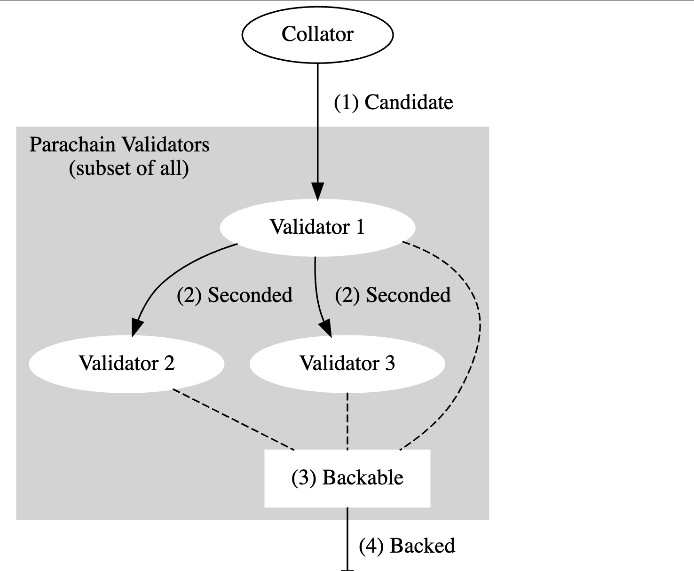

# ClusterTracker

## Background
In the early stage of parablock life cycle, collator forwards the parablock(candidate) and its PoV to the validator set 
assigned to the same parachain after it produces a parablock. Validator set then participate the Candidate Backing 
Subsystem to validate. If candidate gets enough signed validation statements, it is considered as backable.  

During the Candidate backing, each validator in the validator set needs to ensure the received candidate is valid 
and generates the appropriate validation statement. If one candidate is considered valid, the signed validation 
statement of it will be forwarded to other validators by the statement distribution subsystem(this is called Seconded).  

Statement distribution subsystem is responsible for distributing the signed statements that validators have generated 
and forwarding statements generated by the peers. Only the candidate with validation statements reaching to the 
backing-group quorum will be considered as Backable.  

Here, it is important to notice that every well-connected node is aware of every next potential parachain block, 
including validators within the current parachain validator set(in-group) and validators assigned to other 
parachains at this moment(out-group). For statement distribution, in-group validators need to consider all seconded 
candidates. This is call Cluster mode; Out-group validators only need to consider Backable candidate from other groups.
This is called Grid mode.  



## Cluster Mode
Validator nodes are partitioned into groups, and validators within a group at a relay-parent can send each other 
statement messages for any candidates within that group and based on that relay-parent.

If a validator is disabled in the runtime, other validators should no longer accept statements from it.

There are `Seconded` statement and `Valid` statement. Seconded statement must be sent before Valid statement. The statement
is always a `CompactStatement` carrying a hash and signature.

## ClusterTracker
The cluster module(AKA ClusterTracker) provides direct distribution of unbacked candidates within a group.
The clusterTracker determines whether to accept/reject messages from other validators in the same group. 
It keeps track of what we have sent to other validators in the group, and pending statements.  

## ClusterTracker Struct
```go
package statementdistribution

import parachaintypes "github.com/ChainSafe/gossamer/dot/parachain/types"

// ClusterTracker is utility for keeping track of limits on direct statements within a group.
type ClusterTracker[T parachaintypes.CompactStatementValues, F taggedKnowledge[T]] struct {
   validators     []parachaintypes.ValidatorIndex
   secondingLimit uint
   knowledge      map[parachaintypes.ValidatorIndex]map[F]struct{}
   // Statements known locally which haven't been sent to particular validators.
   // maps target validator to (originator, statement) pairs.
   pending map[parachaintypes.ValidatorIndex]map[originatorCompactStatement[T]]struct{}
}

// originatorCompactStatement is a pair of (originator, statement)
type originatorCompactStatement[T parachaintypes.CompactStatementValues] struct {
	validator        parachaintypes.ValidatorIndex
	compactStatement T
}
```

### Dependencies of ClusterTracker

#### 1.Seconding Limit
The seconding limit is a per-validator limit. Validator is able to second multiple candidates per relay parent.
The seconding limit is set to max depth + 1 to set an upper bound on candidates entering the system.  


#### 2.Knowledge  
A piece of knowledge about a candidate
```go
package statementdistribution

import parachaintypes "github.com/ChainSafe/gossamer/dot/parachain/types"

// general knowledge
type general struct {
   parachaintypes.CandidateHash
}

// specific knowledge of a given statement (with its originator)
type specific[T parachaintypes.CompactStatementValues] struct {
   validator        parachaintypes.ValidatorIndex
   compactStatement T
}

// knowledge is a piece of knowledge about a candidate
type knowledge[T parachaintypes.CompactStatementValues] interface {
   general | specific[T]
}
```

#### 3.TaggedKnowledge  
Knowledge paired with its source(originator)
```go
package statementdistribution

import parachaintypes "github.com/ChainSafe/gossamer/dot/parachain/types"

// incomingP2P is one possible type of TaggedKnowledge we have received from the validator on the p2p layer.
type incomingP2P[T parachaintypes.CompactStatementValues] knowledge[T]

// outgoingP2P is one possible type of TaggedKnowledge we have sent to the validator on the p2p layer.
type outgoingP2P[T parachaintypes.CompactStatementValues] knowledge[T]

// seconded is one possible type of TaggedKnowledge of candidates the validator has seconded.
// This is limited only to `Seconded` statements we have accepted without prejudice
type seconded struct {
   parachaintypes.CandidateHash
}

// taggedKnowledge is Knowledge paired with its source.
type taggedKnowledge[T parachaintypes.CompactStatementValues] interface {
   incomingP2P[T] | outgoingP2P[T] | seconded
}
```

### Returning types and Errors definition
```go
// Accept means incoming statement was accepted.
type Accept int

const (
	// Ok is one of the Accept type value.
	// Neither the peer nor the originator have apparently exceeded limits. Candidate or statement may already be known.
	Ok Accept = iota
	// WithPrejudice is one of the Accept type value.
	// Accept the message; the peer hasn't exceeded limits but the originator has.
	WithPrejudice
)

// Incoming statement was rejected
var errRejectIncomingExcessiveSeconded = errors.New("Peer sent excessive Seconded statements.")
var errRejectIncomingNotInGroup = errors.New("Sender or originator is not in the group.")
var errRejectIncomingCandidateUnknown = errors.New("Candidate is unknown to us. Only applies to Valid statements.")
var errRejectIncomingDuplicate = errors.New("Statement is duplicate.")

// Outgoing statement was rejected
var errRejectOutgoingCandidateUnknown = errors.New("Candidate was unknown. Only applies to Valid statements.")
var errRejectOutgoingExcessiveSeconded = errors.New("We attempted to send excessive Seconded statements. indicates a bug on the local node's code.")
var errRejectOutgoingKnown = errors.New("The statement was already known to the peer.")
var errRejectOutgoingNotInGroup = errors.New("Target or originator not in the group.")
```

## Methods of ClusterTracker

1. Constructor of ClusterTracker: Instantiate a new ClusterTracker. Fails if clusterValidators is empty
```go
func NewClusterTracker[T parachaintypes.CompactStatementValues, F taggedKnowledge[T]](
clusterValidators []parachaintypes.ValidatorIndex,
secondingLimit uint,
) (*ClusterTracker[T, F], error)
```

2. CanReceive: Query whether we can receive some statement from the given validator.
```go
func (c *ClusterTracker[T, F]) CanReceive(sender parachaintypes.ValidatorIndex, originator parachaintypes.ValidatorIndex, statement T) (Accept, error)
```

3. NoteIssued: Note that we issued a statement. This updates internal structures.
```go
func (c *ClusterTracker[T, F]) NoteIssued(originator parachaintypes.ValidatorIndex, statement T)
```

4. NoteReceived: Note that we accepted an incoming statement. This updates internal structures.
```go
func (c *ClusterTracker[T, F]) NoteReceived(sender parachaintypes.ValidatorIndex, originator parachaintypes.ValidatorIndex, statement T)
```

5. CanSend: Query whether we can send a statement to a given validator.
```go
func (c *ClusterTracker[T, F]) CanSend(target parachaintypes.ValidatorIndex, originator parachaintypes.ValidatorIndex, statement T) error
```

6. NoteSent: Note that we sent an outgoing statement to a peer in the group. This must be preceded by a successful can_send call.
```go
func (c *ClusterTracker[T, F]) NoteSend(target parachaintypes.ValidatorIndex, originator parachaintypes.ValidatorIndex, statement T)
```

7. Targets: Get all targets as validator-indices. This doesn't attempt to filter out the local validator index.
```go
func (c *ClusterTracker[T, F]) targets() []parachaintypes.ValidatorIndex
```

8. SendersForOriginator: Get all possible senders for the given originator. Returns the empty slice in the case that the originator is not part of the cluster.
```go
func (c *ClusterTracker[T, F]) SendersForOriginator(originator parachaintypes.ValidatorIndex) []parachaintypes.ValidatorIndex
```

9. KnowsCandidate: Whether a validator knows the candidate is Seconded.
```go
func (c *ClusterTracker[T, F]) KnowsCandidate(validator parachaintypes.ValidatorIndex, candidateHash parachaintypes.CandidateHash) bool
```

10. CanRequest: Whether a validator can request a candidate from us.
```go
func (c *ClusterTracker[T, F]) CanRequest(target parachaintypes.ValidatorIndex, candidateHash parachaintypes.CandidateHash) bool
```

11. PendingStatementsFor: Returns a slice of pending statements to be sent to a particular validator index. Seconded statements are sorted to the front of the vector.
```go
func (c *ClusterTracker[T, F]) PendingStatementsFor(target parachaintypes.ValidatorIndex) []OriginatorCompactStatement[T]
```

12. WarnIfTooManyPendingStatements: Dumps pending statement for this cluster into log
```go
func (c *ClusterTracker[T, F]) WarnIfTooManyPendingStatements(parentHash common.Hash)
```