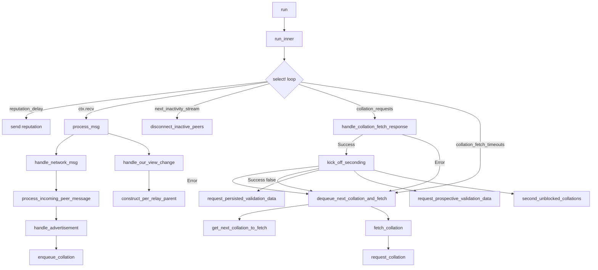

# Collator Protocol: Validator Side

The Collator Protocol implements the network protocol by which collators and validators communicate. It is used by collators to distribute collations to validators and used by validators to accept collations by collators.

The **Validator-Side**, as any subsystem, has an inner state and a `Run` method with a action loop. However differently from other subsystems, the **Validator-Side** does not expect handling `ActiveLeavesSignal`.



## State

The subsystem state is composed by:

- Active Leaves
- Collator's data
- Current parachains we're assigned to
- Collation request information (ongoing requests, cancelations and timeouts)
- Collations sucessfully fetched waiting validation
- Collations blocked (due to missing parent block data)

## Action Loop

The subsystem listen to a set of channels on his action loop:

- Reputation Delay: used to batch reputations and send every X amount of time to Network Bridge, that is done through `Reputation Aggregator`
- Overseer Communication Channel: used to receive communication from overseer
- Inactivity Ticker: used to disconnect useless/inative peers.
- Collation Response Stream: each request is bounded to the action loop so when the response arrives it is handled in the main action loop.
- Collation Request Timeouts: on each request dispatch a timeout timer is initialized as binded in the main loop, so once it triggers, meaning a request could not succeed due to a timeout, it starts dispatches the next collation request.


### Overseer Communication Channel

The messages we expect to receive from the oveerser as running collator protocol in `validator-side` mode is:

- Network Bridge Update
    - Peer Connected/Disconnected: Update the subsystem state adding a new peer when connected or removing when disconnects. **NOTE:** The peer when it connects we don't mark it as `Collating` directly but as just `Connected`, to be `Collating` the peer must send a message `Declare` with the `ParaID` it is collating for and its signature.
    - Peer View Change: When the peer has a new view of the chain (such as a new latest finalized block or a new leaf was added) it sends us this message. If the peer is collating we should remove out-of-date `advertisements` (advertisements for relay-parents that are out of the implicit view).
        - Cancel any ongoign collation request for out-of-date relay parents.
    - Our View Change (*why not use `ActiveLeavesUpdateSignal`*): Means we have new chain information, for new relay parent blocks we query the runtime constructing a new `PerRelayParent`
        - For the relay parents outside the implicit view cancel the ongoing requests
        - Remove any blocked collations relying on removed relay parents
        - Disconnect peers who are not relevant to our current or next para.
    - [Peer Message](https://github.com/paritytech/polkadot-sdk/blob/e000a5c42c7aee5ce08bb9f5f40bf17ac4005a0e/polkadot/node/network/collator-protocol/src/validator_side/mod.rs#L757): This handler process incoming [`CollatorProtocolMessages` ](https://github.com/paritytech/polkadot-sdk/blob/058b4f52fe308697419d590e0a7bd2b520410a2f/polkadot/node/network/protocol/src/lib.rs#L469)from other peers. The unique difference from `V1` and `V2` is the `AdvertiseCollation`, V1 contains only the relay parent hash while in V2 it contains the relay parent hash, candidate hash and parent head data hash (hash of the parent block of the current candidate block)
        - Declare: first contact between collator and validator, indicating a collator wants to collate a specific parachain ID, this must be sent once and should be for the same parachain ID we are assigned to.
        - V1/V2 Advertise Collation: A message indicating the collator have a collation ready for relay parent. The difference is that V2 has more information that will help to validate. In both cases they will pass to a series of check (relay parent must be active, must exists a valid claim...) and then a collation request will be enqueued to fetch the full collation data.
        - CollationSeconded: Ignored on `validator-side` mode.
- Seconded: Message received from `Candidate Backing` subsystem notifying a candidate collation was sucessfully seconded.
    - Notifies the collation about its seconded collation [notify_collation_seconded](https://github.com/paritytech/polkadot-sdk/blob/e000a5c42c7aee5ce08bb9f5f40bf17ac4005a0e/polkadot/node/network/collator-protocol/src/validator_side/mod.rs#L630)
    - Unblocks collations to be seconded [second_unblocked_collations](https://github.com/paritytech/polkadot-sdk/blob/e000a5c42c7aee5ce08bb9f5f40bf17ac4005a0e/polkadot/node/network/collator-protocol/src/validator_side/mod.rs#L997)
    - Dispatch new collation request [dequeue_next_collation_and_fetch](https://github.com/paritytech/polkadot-sdk/blob/e000a5c42c7aee5ce08bb9f5f40bf17ac4005a0e/polkadot/node/network/collator-protocol/src/validator_side/mod.rs#L1751)
- Invalid: Message received from `Candidate Backing` meaning that a collation was not sucessfull in the validation steps. 
    - Reports the collator reducing its reputation, dispatch a new collation request.

### Collation Response Stream

Every request is manager as a Unordered Future, which is some async code that once finished it yields the result to the main loop.

Once a collation response arrives it is transformed into a [`PendingCollationFetch` ](https://github.com/paritytech/polkadot-sdk/blob/e000a5c42c7aee5ce08bb9f5f40bf17ac4005a0e/polkadot/node/network/collator-protocol/src/validator_side/collation.rs#L184) by [`handle_collation_fetch_response`](https://github.com/paritytech/polkadot-sdk/blob/e000a5c42c7aee5ce08bb9f5f40bf17ac4005a0e/polkadot/node/network/collator-protocol/src/validator_side/mod.rs#L1977) and then send to the seconding mechanism by [`kick_off_seconding`](https://github.com/paritytech/polkadot-sdk/blob/e000a5c42c7aee5ce08bb9f5f40bf17ac4005a0e/polkadot/node/network/collator-protocol/src/validator_side/mod.rs#L1832C10-L1832C28).

While kick off seconding, one important information we need to have prior to send the Candidate to `CandidateBacking` subsystem is the [`PersistedValidationData`](https://paritytech.github.io/polkadot-sdk/book/types/candidate.html?highlight=PersistedValidationData#persistedvalidationdata), which can be retrieved from `ProspectiveParachains` subsystem in case the collator version is `CollatorVersion::V2` or from  the runtime executing the `Parachains_persisted_validation_data` call. If the PVD cannot be retrieved then we mark the collation as blocked until we second its parent.

#### Requests cancelation

There should exists a collation request cancellation enabling the subsystem to cancell ongoign requests based on the subsystem business logic such as when a relay parent goes out of implicit view meaning the collation is not important.

For that purpose, Polkadot-SDK has a field called `collation_requests_cancel_handles` which is maping of PendingCollation (unique identifier of the collation request) to a CancellationToken, that is bounded to the [`CollationFetchRequest` Futures](https://github.com/paritytech/polkadot-sdk/blob/e000a5c42c7aee5ce08bb9f5f40bf17ac4005a0e/polkadot/node/network/collator-protocol/src/validator_side/collation.rs#L350).

As a suggestion, our implementation could have a single response channel that is bounded to the main loop.

```go=
func (s *Subsystem) Run() {
    
    for {
        select {
            ...
            resp := <-s.responseCh:
            
        }
    }
}
```

Whenever we dispatch a collation request we send this channel as well as a ctx of type `context.Context`, so we keep the cancelation function within the subsystem state.

```go=
func (s *Subsystem) fetchCollation() {
    ctx, cancel := context.WithCancel(context.Background())
    
    reqMaker.Do(ctx, s.responseCh, msg)
    s.requestCancels[msg.uniqueID()] = cancel
}
```

So any time we need to cancel an ongoing request we can easily retrieve from the `requestCancels` inside the subsystem state and trigger the context cancellation.
