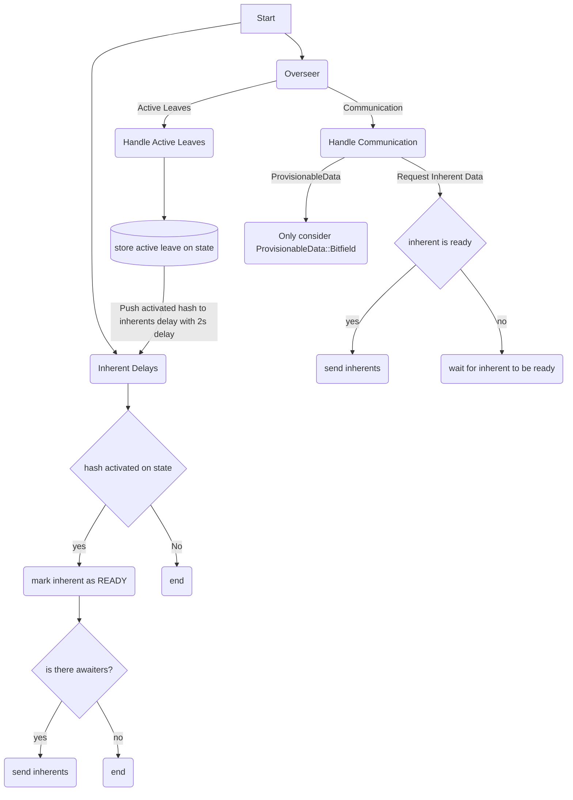

# Provisioner Subsystem

## Intro

The provisioner is responsible for assembling a relay chain block from a set of available parachain candidates of its choice, and it is specified in the [The Polkadot Parachain Host Implementers' Guide](https://paritytech.github.io/polkadot-sdk/book/node/utility/provisioner.html).

## Flow

Provisioner flow is based on 2 channels: overseer channel and the inherents delay channel. From the overseer we listen only `ActiveLeaves` and`Communication` signals. The inherent delays is a time based channel that release a relay chain block hash after some delay T.


The above flowchart explains the overall Provisioner flow. Provisioner is the subsystem component that connects with block production, so when a validator is choosen as a block producer it needs to engage with the subsytem by sending a `ProvisionerMessage::RequestInherentData`, the response should be a [Para Inherent Data](https://paritytech.github.io/polkadot-sdk/book/types/runtime.html#parainherentdata).

The inherent might not be ready to be retrieved, in such case we can wait up to 2 seconds, as defined in the [`PRE_PROPOSE_TIMEOUT` constant](https://github.com/paritytech/polkadot-sdk/blob/eea4fbff8b1b5e9b44963acee656af92c315127c/polkadot/node/core/provisioner/src/lib.rs#L60)

## State

The provisioner state is composed by two maps, `PerRelayParent`, which is a map from `common.Hash` to `PerRelayParent` and `PerSession`, which is a map from `SessionIndex` to `PerSession`.

- `PerRelayParent`:
```go
type PerRelayParent struct {
    leaf BlockHashAndNumber
    elasticScalingMVP bool
    signedBitfields []SignedAvailabilityBitfield
    isInherentReady bool
    awaitingInherent []chan any 
}
```
- `PerSession`:
```go
type PerSession struct {
    elasticScalingMVP bool 
}
```

The `PerRelayParent` tracks the signedBitfields provisionable data we receive through `Handle Communication` flow. The `PerSession` is acts like a caching, every time an active leaf arrives we check if its session index already exists in the state, if so we use it, otherwise we call `request_node_features` querying the runtiem specifically checking it `FeatureIndex::ElasticScalingMVP` is enabled and we set that in the state, so we prevent future runtime call.


## [Send Inherent Data](https://github.com/paritytech/polkadot-sdk/blob/eea4fbff8b1b5e9b44963acee656af92c315127c/polkadot/node/core/provisioner/src/lib.rs#L383)

Provisioner only sends inherent data if there is first a request for it. The inherents are partially tracked under `PerRelayParent` struct (the `signedBitfields` are one part of the inherent data), the other inhernets are: `backedCandidates` and `disputes`.

While sending a inherent the provisioner will perform calls to other subsystems as well as runtime queries, so the function `sendInhrentData` should be a goroutine with a timeout of 500ms as defined by [`SEND_INHERENT_DATA_TIMEOUT` constant](https://github.com/paritytech/polkadot-sdk/blob/master/polkadot/node/core/provisioner/src/lib.rs#L62).

Before sending the inherents data we should assemble all the needed info:

1. [Request availability cores](https://github.com/paritytech/polkadot-sdk/blob/eea4fbff8b1b5e9b44963acee656af92c315127c/polkadot/node/core/provisioner/src/lib.rs#L396)
2. [Select the disputes](https://github.com/paritytech/polkadot-sdk/blob/eea4fbff8b1b5e9b44963acee656af92c315127c/polkadot/node/core/provisioner/src/lib.rs#L407)
3. [Select availability bitfields](https://github.com/paritytech/polkadot-sdk/blob/eea4fbff8b1b5e9b44963acee656af92c315127c/polkadot/node/core/provisioner/src/lib.rs#L415)
4. [Select candidates](https://github.com/paritytech/polkadot-sdk/blob/eea4fbff8b1b5e9b44963acee656af92c315127c/polkadot/node/core/provisioner/src/lib.rs#L423)

After collecting all the informations needed, we can send the `ProvisionerInherentData` through the returning channel.

## [Disputes: Prioritized Selection](https://github.com/paritytech/polkadot-sdk/blob/master/polkadot/node/core/provisioner/src/disputes/prioritized_selection/mod.rs)

While assembling the inherents data one of its components is the disputes, which is selected through a prioritized selection.

It queries the Runtime about the votes already known onchain and tries to select only relevant votes.

##### How  the prioritization works?

Generally speaking disputes can be described as:
- Active vs Inactive
- Known vs Unknown onchain
- Offchain vs Onchain
- Concluded onchain vs Unconcluded onchain

Provisioner fetches all disputes from `dispute-coordinator` and separates them in multiple  partitions, see [struct PartitionedDisputes](https://github.com/paritytech/polkadot-sdk/blob/71c19e4c7ca2b411722ec7d9c1392e1bd81b5681/polkadot/node/core/provisioner/src/disputes/prioritized_selection/mod.rs#L274). Each partition has got a priority implicitly assigned to it and the disputes are selected based on this priority (e.g. disputes in partition 1, then if there is space - disputes from partition 2 and so on)

##### Vote Selection

Besides the prioritization described above the votes in each partition are filtered too. Provisioner fetches all onchain votes and filters them out from all partitions. As a result the Runtime receives only fresh votes (votes it didn't know about).

##### Flow

1. Retrieve on chain disputes, if the runtime does not support the `Disputes` method then return empty
2. Retrieve recent disputes, we should send the message `DisputeCoordinatorMessage::RecentDisputes` to `disputes-coordinator` subsytem to retrieve the current offchain disputes that we track. We should remove disputes filter out unconfirmed disputes that are unkown on chain.
3. [Partition recent disputes](https://github.com/paritytech/polkadot-sdk/blob/0f2024f5f33acc54d90fe209289d0195c8af9a70/polkadot/node/core/provisioner/src/disputes/prioritized_selection/mod.rs#L274), the partition starts with separating ACTIVE disputes from INACTIVE disputes (based on the dipute status). After that for each group we check:
- [Active/Inactive] Known on chain and concluded (meet the supermajority amount of votes)
- [Active/Inactive] Known on chain but not concluded (does not reach the supermajority votes)
- [Active/Inactive] Unkown on chain.

4. [Vote selection](https://github.com/paritytech/polkadot-sdk/blob/71c19e4c7ca2b411722ec7d9c1392e1bd81b5681/polkadot/node/core/provisioner/src/disputes/prioritized_selection/mod.rs#L179C39-L179C49), given the already all paritioned disputes sorted by their priority order we should select the relevant votes. First we should send the message `DisputeCoordinatorMessage::QueryCandidateVotes(disputes)` to collect the votes tracked by `disputes-coordinator` subsytems, we should filter out votes already known on chain and hold only the ones that are offchain, so we provide relevant data to the runtime. There is also a limit of 200.000 votes that can be sent to the runtime, defined by [`MAX_DISPUTE_VOTES_FORWARDED_TO_RUNTIME`](https://github.com/paritytech/polkadot-sdk/blob/c078d2f41cf8ecd28ff5279fcebb22da418a14b9/polkadot/node/core/provisioner/src/disputes/prioritized_selection/mod.rs#L44). The returned value is ordered by `Session Index` and `Candidate Hash` and what is returned a list of `{ Session Index, Candidate Hash, [Votes] }`. The set of votes are also called as statements.