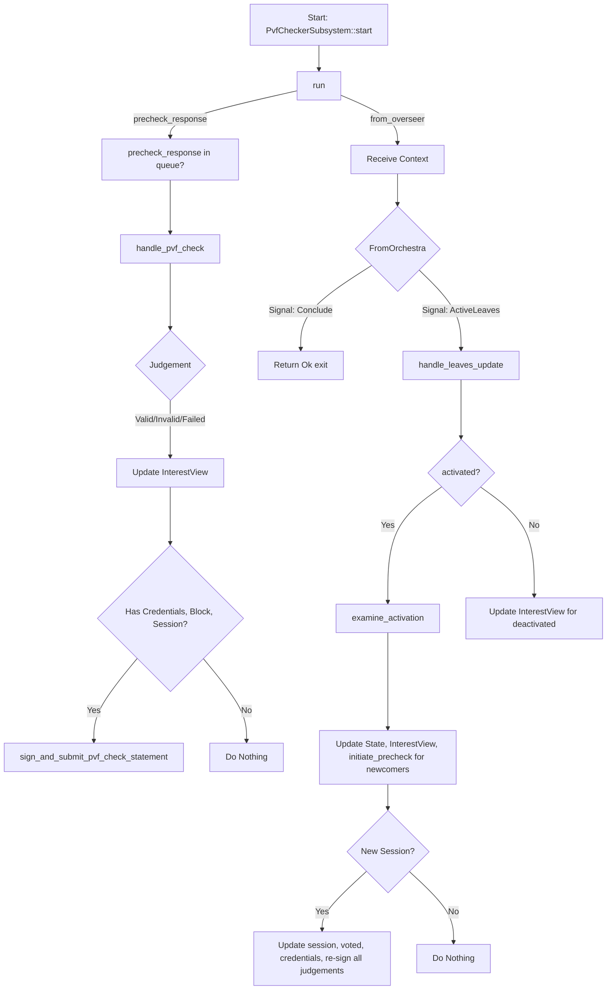

PVF is a Parachain Validation Function, which is a WASM blob that defines how a parachain should be validated.
Pre-checking mostly consists of attempting to prepare (compile) the PVF WASM blob. We use more strict limits (e.g. timeouts) here compared to 
regular preparation for execution. This way errors during preparation later are likely unrelated to the PVF itself, as it already passed pre-checking.
We can treat such errors as local node issues.
We also have an additional step where we attempt to instantiate the WASM runtime without running it. 
This is unrelated to preparation so we don't time it, but it does help us catch more issues.

Pre-checking is run when a new validation code is included in the chain. A new PVF can be added in two cases:
- A new parachain is registered.
- An existing parachain signalled an upgrade of its validation code.

Before any of those operations finish, the PVF pre-checking vote is initiated.
The PVF pre-checking vote is identified by the PVF code hash that is being voted on. If there is already PVF pre-checking process running, 
then no new PVF pre-checking vote will be started. Instead, the operation just subscribes to the existing vote.

2/3 of validators needed to vote for the PVF to be approved. If it is not collecting enough votes it is considered as rejected.

Only validators from the active set can participate in the vote. The set of active validators can change each session. 
That's why we reset the votes each session. A voting that observed a certain number of sessions will be rejected.

PVF-accepted:
1. All newly registered parachains that passed the PVF pre-checking process will get scheduled and after passing 2 session boundaries they will be onboarded.
2. All upgrades subscribed to the approved PVF pre-checking process will get scheduled very similarly to the existing process. 
   Upgrades with pre-checking are really the same process that is just delayed by the time required for pre-checking voting. 
   In case of instant approval the mechanism is exactly the same.

**PVF-rejection:**
If PVF pre check is rejected onboarding of the parachain or runtime upgrade will be rejected.

This logic described in [Paras Pallet](https://paritytech.github.io/polkadot-sdk/book/runtime/paras.html)


Off-chain part:

Node scan the chain for new PVF with calling runtime.

The first runtime API is designed to fetch all PVFs that require pre-checking voting. The PVFs are identified by their code hashes. 
As soon as the PVF gains required support, the runtime API will not return the PVF anymore.
```rust
fn pvfs_require_precheck() -> Vec<ValidationCodeHash>;
```

If a new PVF was found, the subsystem sends a PVF pre-checking request to the candidate validation subsystem and waits for the result. Then based on the result it submits the vote.

ThThe second runtime API is needed to submit the judgement for a PVF, whether it is approved or not. 
The voting process uses unsigned transactions. The PvfCheckStatement is circulated through the network via gossip similar to a normal transaction. 
At some point the validator will include the statement in the block, where it will be processed by the runtime. 
If that was the last vote before gaining the super-majority, this PVF will not be returned by pvfs_require_precheck anymore.

```rust
fn submit_pvf_check_statement(stmt: PvfCheckStatement, signature: ValidatorSignature);
```

The vote will be distributed via the gossip similarly to a normal transaction. 
Eventually a block producer will include the vote into the block where it will be handled by the runtime.


One of the main units of information on which PVF pre-checking voting is build is the PvfCheckStatement.

This is a statement by the validator who ran the pre-checking process for a PVF. A PVF is identified by the ValidationCodeHash.

The statement is valid only during a single session, specified in the session_index.

```rust
struct PvfCheckStatement {
    /// `true` if the subject passed pre-checking and `false` otherwise.
    pub accept: bool,
    /// The validation code hash that was checked.
    pub subject: ValidationCodeHash,
    /// The index of a session during which this statement is considered valid.
    pub session_index: SessionIndex,
    /// The index of the validator from which this statement originates.
    pub validator_index: ValidatorIndex,
}
```


There is no dedicated input mechanism for PVF pre-checker. Instead, PVF pre-checker looks on the ActiveLeavesUpdate event stream for work.
The subsystem does not produce any output messages either, instead it sends messages to Runtime API  to query for the pending PVFs and to submit votes.
In addition to that, it will also communicate with Candidate Validation Subsystem to request PVF pre-check.

If the node is running in a collator mode, this subsystem will be disabled.

The PVF pre-checker subsystem keeps track of the PVFs that are relevant for the subsystem. By  fetching them from runtime API 
for every active leave.
If the PVF is not present in any of the active leaves, it ceases to be relevant.
PVF-precheck subsystem ask Candidate Validation subsystem to check on the PVF validity the result is submited to runtime API with
`submit_pvf_check_statement`
In case, a judgement was received for a PVF that is no longer in view it is ignored. << This probably means that if CV taking long ot response for PVF that is not any more in activel lives then we ignore it

Whe session changes (at least one of the new active leave session index is > then prev on any of the leaves)  subsystem resign and submit only new session PVFs.

If the node is not in the active validator set, it still performs all the checks. However results are submitted only if it is in the active set.

### Rejection
If candidate validation was not able to check PVF eg timed out then subsystem votes against it. There is no slashing for being on the wrong side of a pre-check vote.
                                                                                                                                                                                                                                                                                                                                                                                                                                                                                                                                                                                                                                                                                                                                                                                                                                                                                                                                                                                                                                                                                                                                                                                                                                                                                                                                                                                                                                                                                                                                                                                                                                                                                                                                                                                                                                                                                                                                                                                                                                                                                                                                                                                                                                                                                                                                                                                                                                                                                                                                                                                                                                                                                           


### Implementation 



The main module is within `polkadot/node/core/pvf-checker`.


Subsystem should listen to events from overseer and make periodic checks for PVF check results.

Subsystem operates within its `State`. Most important parts of which are collections of PVFs that are observed (`State::InterestView`) 
and list of futures that hold results of currenlty checking PVFs (`State::currently_checking`).
InterestView is a pretty simple struct with map.
currently_checking can be implemented via channel that is listening responses of PVF check goroutines.
Results of PVF check (that is actually happening on Candidate Validation Subsystem) are should be signed and submit
to runtime via `runtime_api::submit_pvf_check_statement`

Subsystem handler only two messages from overseer, the `OverseerSignal::ActiveLeaves` and `OverseerSignal::Conclude`. 
The Conlcude is pretty straight forward and should stop the subsystem process.

#### ActiveLeaves
ActiveLeaves on the other hand is when all the action take place.
When new active leave appears subsystem updates state with new PVFs (if they are exist in new leave) using `InterestView::on_leaves_update` method 
and initiate pre-check for them. PVFs from deactivated leaves are removed from list.
`examine_activation` as a part of `handle_leaves_update` is used to check if there are any new PVFs that need to be pre-checked.
When the new session started we need to check all the judgments for PVFs
We also need to revote for PVFs in view. Why?
This is intentional: when a new session starts, the set of validators may change, and votes from the previous session do not carry over.
Therefore, we must re-submit our votes for all PVFs we have judgements for, so that the new session's votes are up-to-date.


