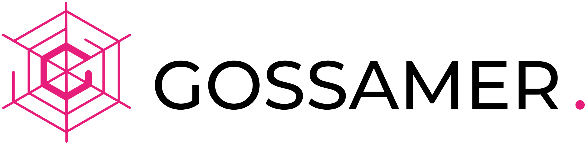

  

## A Go Implementation of the Polkadot Host

Gossamer is an implementation of the <a target="_blank" rel="noopener noreferrer"  href="https://github.com/w3f/polkadot-spec">Polkadot Host</a>: a framework used to build and run nodes for different blockchain protocols that are compatible with the Polkadot ecosystem.  The core of the Polkadot Host is the wasm runtime which handles the logic of the chain.

Gossamer includes node implementations for major blockchains within the Polkadot ecosystem and simplifies building node implementations for other blockchains. Runtimes built with <a target="_blank" rel="noopener noreferrer" href="https://github.com/paritytech/substrate">Substrate</a> can plug their runtime into Gossamer to create a node implementation in Go.

***Gossamer Docs*** is an evolving set of documents and resources to help you understand Gossamer, the Polkadot ecosystem, and how to build and run nodes using Gossamer. 

- If you are new to Gossamer and the Polkadot ecosystem, we recommend starting with <a target="_blank" rel="noopener noreferrer" href="https://www.youtube.com/watch?v=nYkbYhM5Yfk">this video</a>  and then working your way through [General Resources](/getting-started/resources/general-resources/).

- If you are already familiar with Gossamer and the Polkadot ecosystem, or you just want to dive in, head over to [Get Started](/getting-started/installation) to run your first node using Gossamer.

- If you are looking to build a node with Gossamer, learn how Gossamer can be used to build and run custom node implementations using Gossamer as a framework (keep reading).

## Framework

Gossamer is a ***modular blockchain framework*** used to build and run nodes for different blockchain protocols within the Polkadot ecosystem.

- The ***simplest*** way to use the framework is using the base node implementation with a custom configuration file (see [Configuration](/usage/configuration)).

- The ***more advanced***  way to use the framework is using the base node implementation with a compiled runtime and custom runtime imports (see [Import Runtime](/usage/import-runtime)). 

<!-- - The ***most advanced***  way to use the framework is building custom node services or a custom node implementation (see [Custom Services](./usage/custom-services)). -->

Our primary focus has been an initial implementation of the Polkadot Host. Once we feel confident our initial implementation is fully operational and secure, we will expand the Gossamer framework to include a runtime library and other tools and services that will enable Go developers to build, test, and run custom-built blockchain protocols within the Polkadot ecosystem.

## Connect

Let us know if you have any feedback or ideas that might help us improve our documentation or if you have any resources that you would like to see added. If you are planning to use Gossamer or any of the Gossamer packages, please say hello! You can find us on <a target="_blank" rel="noopener noreferrer" href="https://discord.gg/Xdc5xjE">Discord</a>.
